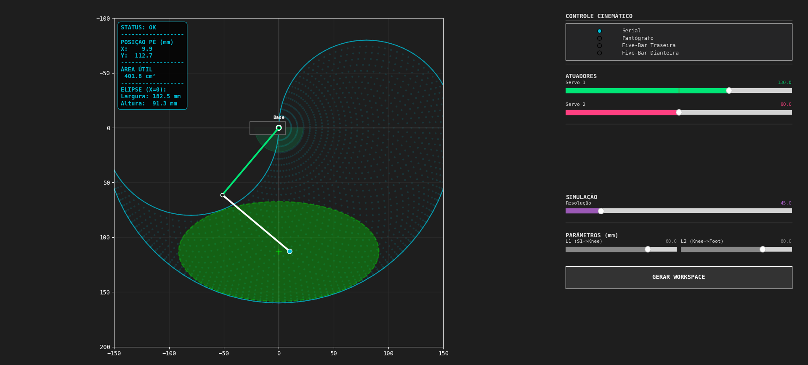
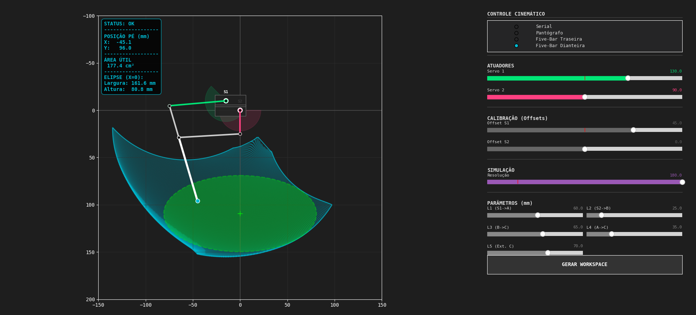

# Simulador cinemático para robótica quadrúpede

[](https://www.python.org/)
[](LICENSE)
[]()

> **Ferramenta de análise, visualização e validação de geometrias de pernas robóticas (2-DOF).**

Este repositório contém o código-fonte do simulador desenvolvido como parte do trabalho sobre **Análise cinemática e otimização de perna 2-DOF de baixo custo**. O software permite a modelagem paramétrica, análise de espaço de trabalho (Workspace) e validação de marcha para diferentes arquiteturas de pernas robóticas.

---

## Visão geral

O simulador oferece feedback visual em tempo real, cálculo de cinemática direta e inversa (implícita), detecção de colisões e análise de viabilidade de marcha.

<p align="center">
  
</p>

### Arquiteturas suportadas

O sistema é modular e atualmente suporta quatro topologias distintas:

| Modelo | Descrição | Aplicação |
| :--- | :--- | :--- |
| **Serial (Direct)** | Configuração clássica "Joelho-Cotovelo". | Simples, mas com alta inércia. |
| **Pantógrafo** | Mecanismo coaxial de 4 barras. | Baixa inércia. |
| **Five-bar (Front)** | Mecanismo paralelo de 5 barras (Tração Dianteira). | Equilíbrio entre torque e velocidade. |
| **Five-bar (Rear)** | Mecanismo paralelo de 5 barras (Tração Traseira). | Otimizado para configurações compactas. |

## Funcionalidades

* **Simulação em tempo real:** Ajuste de ângulos dos servos ($\theta_1, \theta_2$) com feedback visual imediato.
* **Mapeamento de workspace:** Geração de nuvem de pontos baseada em Cinemática direta com detecção de colisão.
* **Análise de fronteira (Concave hull):** Utiliza *Alpha Shapes* para determinar a área útil real do robô, ignorando zonas inatingíveis.
* **Scanner de marcha (Gait validator):** Algoritmo de varredura de perfil que inscreve a maior elipse de marcha possível centrada no eixo de gravidade do robô ($X=0$).
* **Parametrização dinâmica:** Ajuste fino dos comprimentos das hastes ($L_1, L_2, \dots$) e offsets de calibração via interface gráfica.

## Instalação e dependências

Este projeto foi desenvolvido em **Python**. Para executá-lo, certifique-se de ter as bibliotecas necessárias instaladas.

### Pré-requisitos

O arquivo `requirements.txt` contém todas as dependências. As principais são:
* `numpy`: Para álgebra linear e vetorização de cálculos.
* `matplotlib`: Para renderização gráfica e interface de usuário (GUI).
* `scipy`: Para cálculos espaciais (Delaunay Triangulation/Alpha Shapes).

### Passo a passo

1.  Clone este repositório:
    ```bash
    git clone [https://github.com/danielvitorsm/inverse-leg-kinematics.git](https://github.com/danielvitorsm/inverse-leg-kinematics.git)
    cd inverse-leg-kinematics
    `
2.  Criar ambiente:
    ```bash
    python3 -m venv .venv
    # Linux
    source .venv/bin/activate
    # Windows
    .venv\Scripts\activate
    `````

3.  Instale as dependências:
    ```bash
    pip install -r requirements.txt
    
    ```

4.  Execute o simulador:
    ```bash
    python main.py
    ```

## Como usar

<p align="center">
  
</p>

1.  **Seleção de modelo:** Use o painel à direita para alternar entre as pernas (Serial, Pantógrafo, etc).
2.  **Ajuste de atuadores:** Mova os sliders "Servo 1" e "Servo 2" para verificar a cinemática.
3.  **Gerar workspace:** O workspace é calculado automaticamente ao mudar os fatores geométricas. Ao alterar a resolução clique no botão `GERAR WORKSPACE`. O sistema irá calcular a área azul (alcançável) e a elipse verde (marcha sugerida).
4.  **Otimização:** Se o arquivo `best_legs_config.json` estiver presente, o simulador carregará automaticamente as geometrias otimizadas empiricamente.

---

## Estrutura do projeto

* `main.py`: Ponto de entrada da aplicação.
* `dashboard.py`: Gerenciamento da interface gráfica e orquestração dos módulos.
* `ui_manager.py`: Abstração de componentes de UI (Sliders, Botões).
* `utils.py`: Biblioteca matemática (Interseção de círculos, Alpha Shapes, Scanner de Elipse).
* `configs/`: Contém as classes de cada perna (`LegModel`, `FiveBar`, `Pantograph`, etc.).

## 📄 Licença

Este projeto está sob a licença MIT - veja o arquivo [LICENSE](LICENSE) para detalhes.

---

<p align="center">
  <sub>Desenvolvido como material de apoio para pesquisa em robótica quadrúpede.</sub>
</p>